# Optional Task 3: Deploy Monitoring (Prometheus and Grafana)

## Overview

This section outlines the setup and configuration of **Prometheus** and **Grafana** for monitoring the application stack (including **ArgoCD** and **Keycloak**). The monitoring stack was deployed using **Terraform** for infrastructure as code and **ArgoCD** to manage application deployments declaratively.

## Steps

### 1. Namespace and Monitoring Setup Using Terraform

The **observability** stack was deployed in the `observability` namespace. Prometheus and Grafana were configured using the **kube-prometheus-stack** Helm chart, managed via **Terraform**.

- **Helm chart version**: 62.6.0

Terraform also handled the creation of custom dashboards and alerts.

**Relevant files:**
- [Observability Module](../modules/observability/main.tf)

### 2. Enabling Metrics for ArgoCD Components

Metrics were enabled for the following **ArgoCD** components:
- Application Controller
- Repo Server
- ArgoCD Server

Changes to the **ArgoCD** Helm values.yaml were made to expose metrics on specific ports and enabled Prometheus scraping. The configuration was deployed via **Terraform**.

**Relevant files:**
- [ArgoCD Application Manifest](../modules/argocd/values.yaml)

### 3. Enabling Metrics for Keycloak

Keycloak was deployed and managed via ArgoCD. To enable metrics, changes were made to the Keycloak Helm values configuration to expose the `/realms/master/metrics` endpoint for Prometheus scraping. This configuration was applied through ArgoCD, and once the deployment was synced, the metrics endpoint was validated using curl to confirm accessibility.

**Relevant files:**
- [Keycloak Application Manifest](../modules/argocd/apps/keycloak/keycloak-app.yaml)
- [Keycloak Realm Config](../modules/argocd/apps/keycloak/myrealm-config.yaml)

### 4. ServiceMonitor and PodMonitor Configuration

**ServiceMonitor** and **PodMonitor** resources were deployed to enable Prometheus to scrape metrics from both **ArgoCD** and **Keycloak**. These configurations define which services and pods should be monitored, the relevant ports, and scraping intervals.

For Keycloak, a ServiceMonitor was created to scrape metrics from the Keycloak service. PodMonitors were set up for ArgoCD components, including the Application Controller, Repo Server, and ArgoCD Server.

**Relevant files:**
- [ServiceMonitor and PodMonitor Configurations](../modules/observability/servicemonitors)

### 5. Grafana Dashboard Configuration

Custom Grafana dashboards were created for both **ArgoCD** and **Keycloak**, stored in ConfigMaps, and automatically picked up by Grafana’s sidecar. Additionally, out-of-the-box dashboards and alerts from the **kube-prometheus-stack** were included to monitor cluster components and infrastructure health, providing a comprehensive view of both system and application performance.

## Testing

- **Metrics Validation**: Verified that metrics endpoints were exposed and scraped by Prometheus.
- **Prometheus Scrape Validation**: Used Prometheus UI to verify successful scraping of metrics.
- **Grafana Validation**: Checked Grafana dashboards to confirm that metrics were visualized.

#### Screenshots:
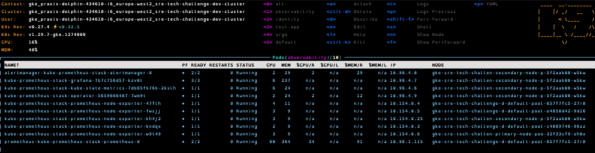
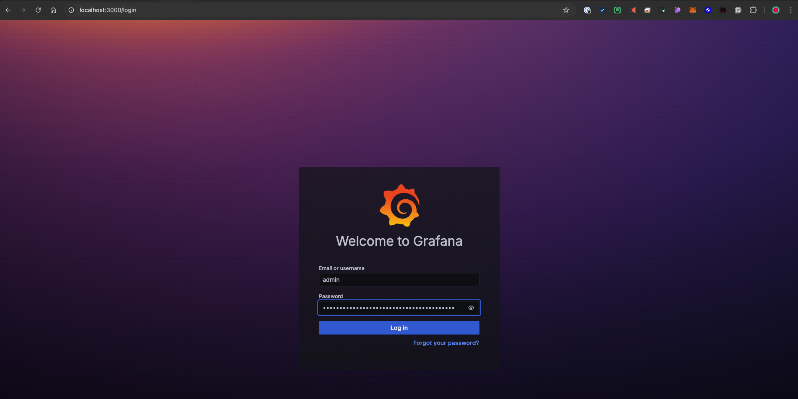
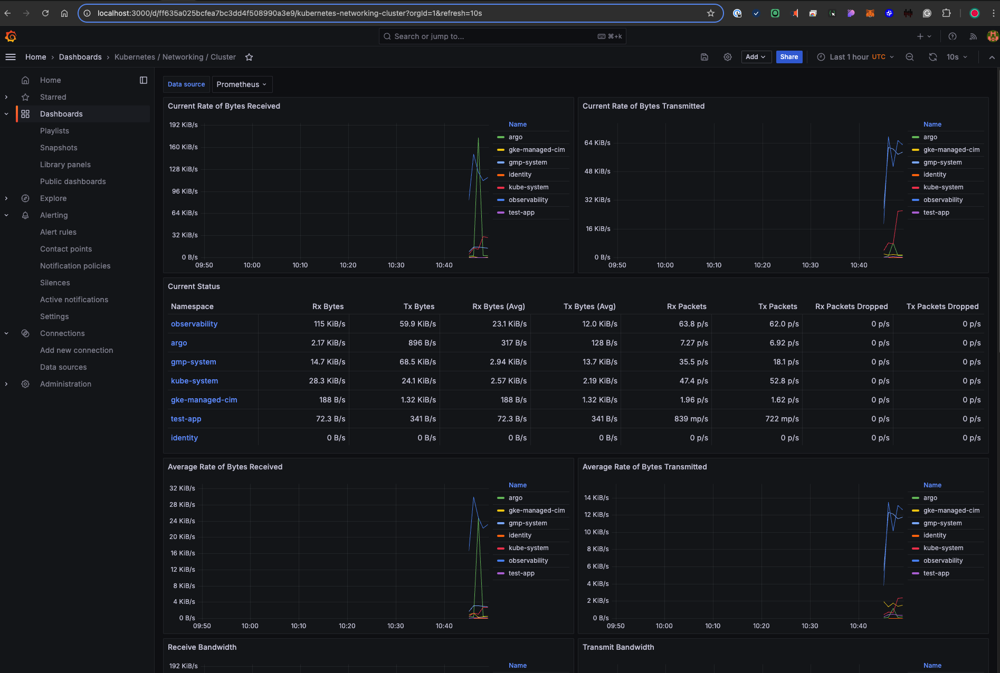
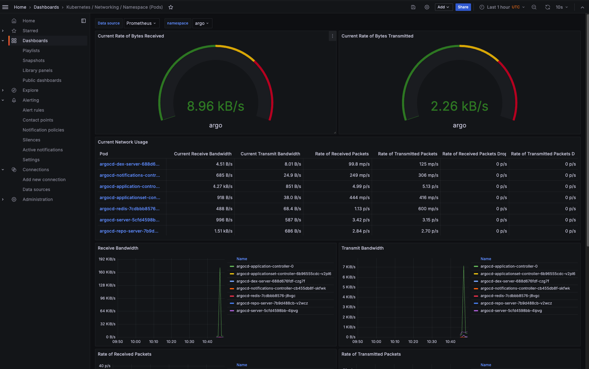
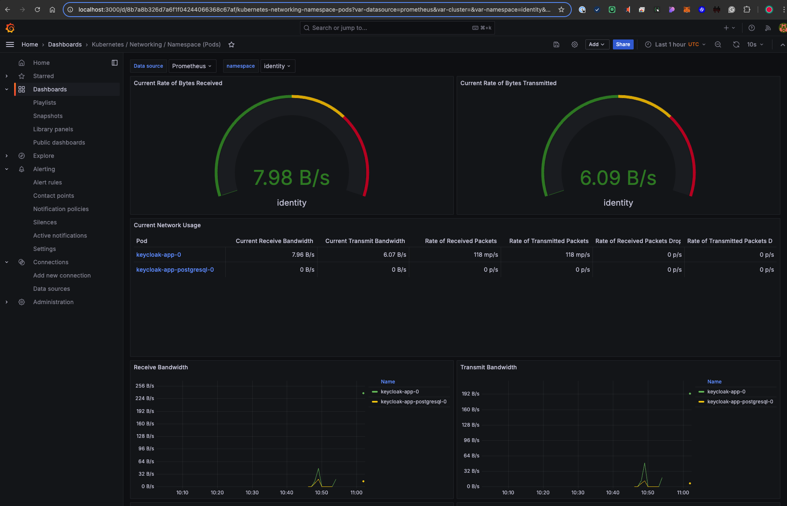
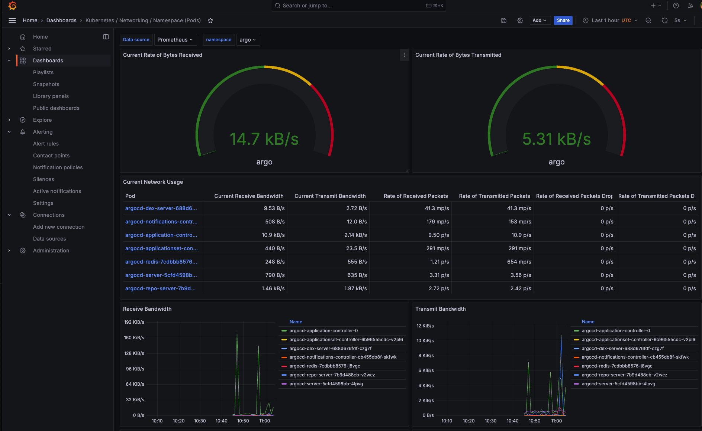
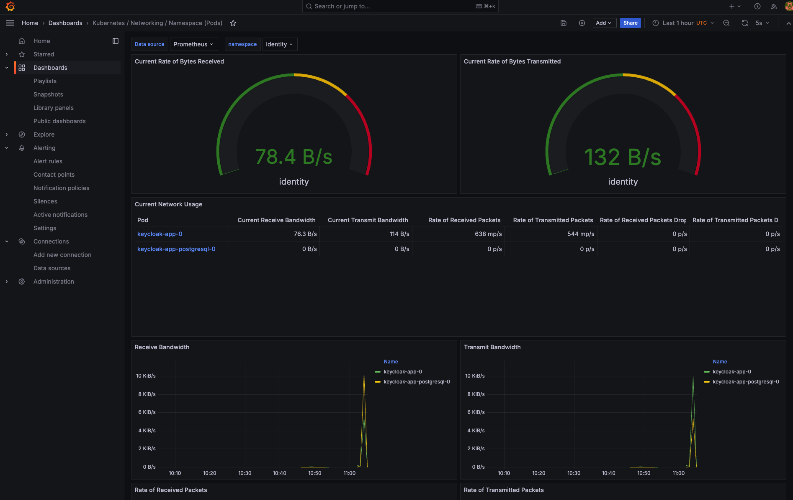
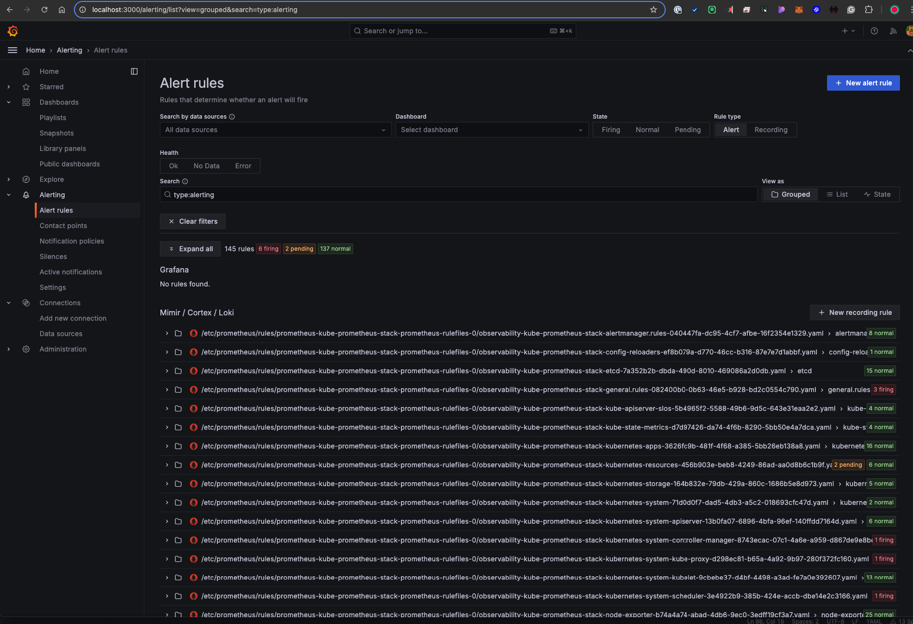
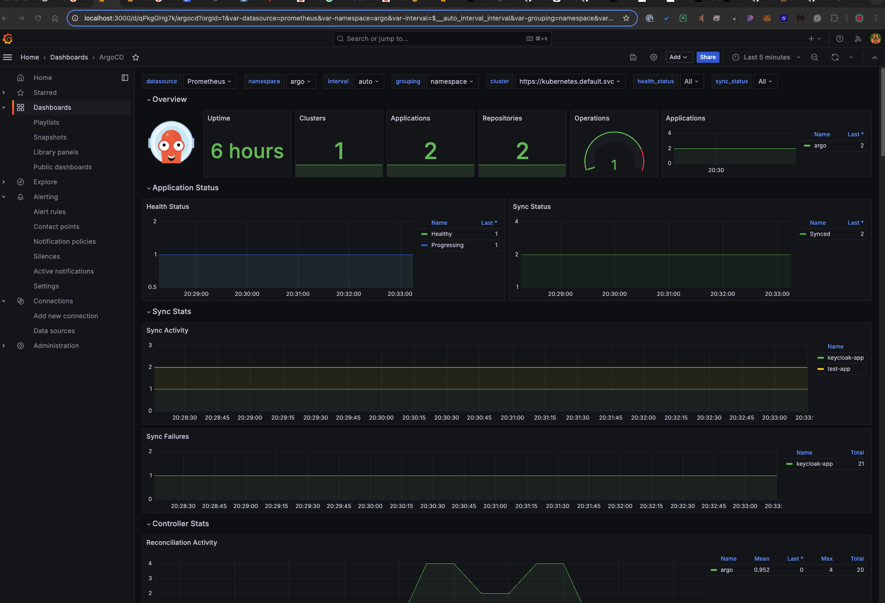
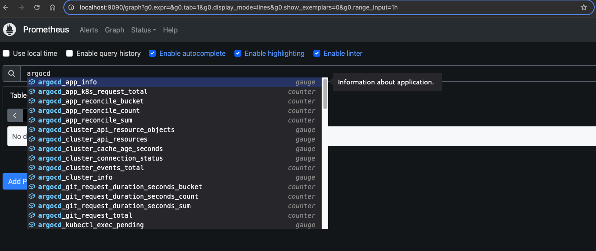
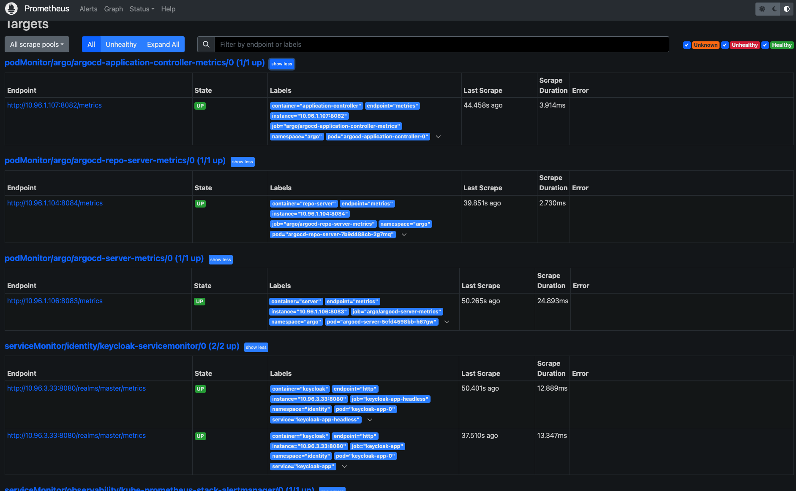
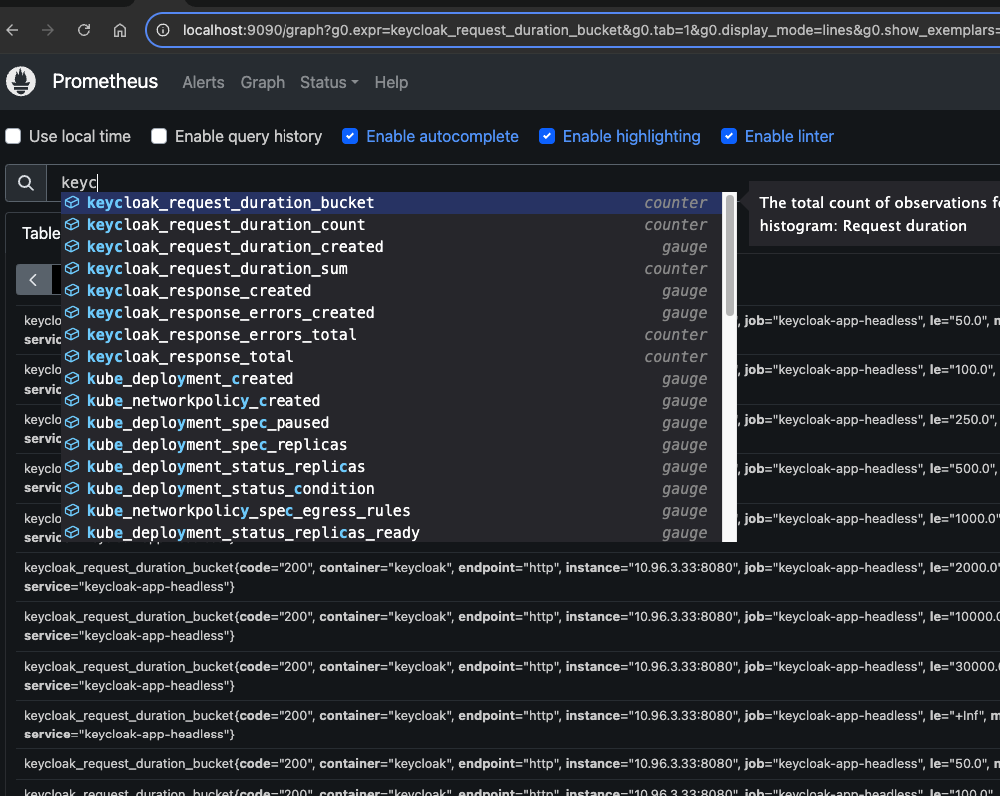
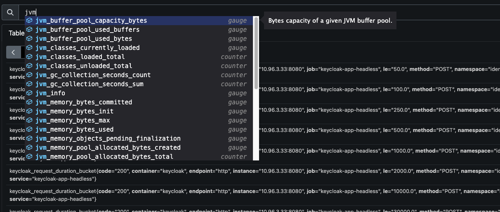
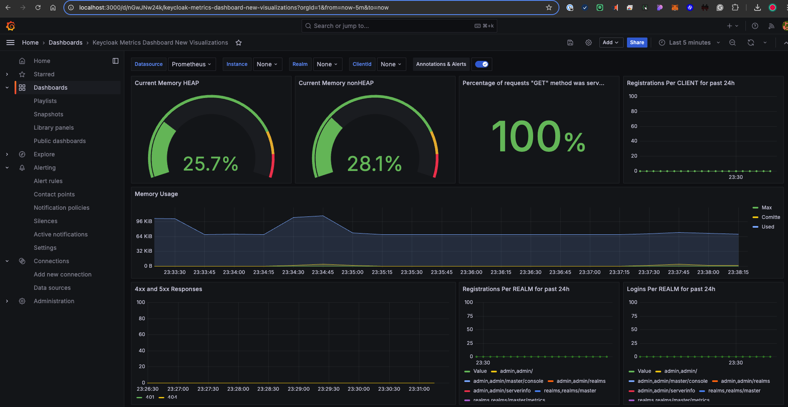

## Production Readiness Considerations

### High Availability

**Current Setup**: Single-instance deployments for Prometheus, Grafana, and Keycloak.

**Recommendations**:
- **Prometheus & Grafana**: Set up Prometheus and Grafana in highly available mode by deploying multiple replicas and using persistent storage to ensure durability.
- **Keycloak**: Scale Keycloak horizontally, deploy multiple replicas, and use a HA PostgreSQL database for resilience.
- **PostgreSQL**: Ensure PostgreSQL is configured with replication and backup strategies for data recovery.

### Security

**Current Setup**: Internal-only access to services, no encryption enabled.

**Recommendations**:
- Enable TLS/SSL for all services, including Prometheus, Grafana, and Keycloak, to secure data in transit.
- Implement authentication and RBAC for Grafana and Prometheus.
- Secure Prometheus metrics endpoints with proper access control and API tokens, leveraging Keycloak for SSO integration.
- Use Kubernetes Secrets to manage sensitive data like Prometheus, Grafana, and Keycloak credentials, and integrate Google Cloud Secret Manager for secret management.

### Monitoring and Alerts

**Current Setup**: Grafana dashboards and real-time metrics were deployed, along with out-of-the-box alerts provided by the **kube-prometheus-stack**, but no additional custom alerting was configured.

**Recommendations**:
- Set up Prometheus AlertManager and define alerts based on key metrics like CPU usage, memory consumption, and failed request rates.
- Integrate AlertManager with notification services such as Slack, Microsoft Teams, or PagerDuty for real-time alerting.
- Establish SLIs (Service Level Indicators) and SLOs (Service Level Objectives) for ArgoCD and Keycloak based on application performance and reliability metrics.
- Enhance observability by adding Pyroscope for distributed tracing across services.
- Set up Kubernetes logging with tools like Loki to centralise and visualise logs for k8's ArgoCD and Keycloak.

### Scalability

**Current Setup**: Single-instance services without scaling.

**Recommendations**:
- Configure horizontal pod autoscaling for Prometheus, Grafana, and Keycloak.
- Use Kubernetes Horizontal Pod Autoscaler (HPA) to dynamically scale services based on custom metrics.
- Integrate Prometheus with Thanos for long-term metric retention and global view across clusters.

### Disaster Recovery

**Current Setup**: No backup or disaster recovery setup.

**Recommendations**:
- Implement automatic backups for Prometheus and Grafana data.
- Ensure Keycloak database backups are scheduled and replicated across regions for high availability.
- Use Kubernetes Persistent Volume Snapshots for disaster recovery of persistent storage.

**Recommendations**:

## Related PR

- [Task 3: Monitoring Deployment](https://github.com/example/sre-tech-challenge/pull/5)