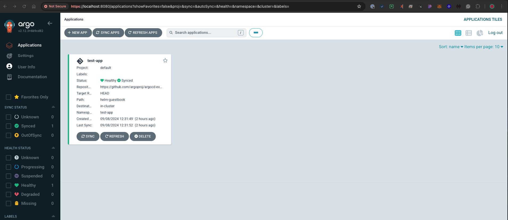

## Overview
This document outlines the steps taken to install ArgoCD in the "argo" namespace using Helm and Terraform. ArgoCD is configured to manage and track application deployments in the Google Kubernetes Engine (GKE) cluster provisioned in Task 1 of the SRE Tech Challenge.

## Steps

### 1. Installing ArgoCD
- ArgoCD was deployed in the `argo` namespace using Helm.
- Key aspects of the installation include:
  - **Helm chart version**: 7.5.2.
  - **Admin password**: A secure hashed password, passed via Terraform.
  - **Service Type**: Using `ClusterIP` with no ingress configuration at this stage.

Relevant files:
- [Helm Installation Configuration](../modules/argocd/main.tf)
- [Helm Values File](../modules/argocd/values.yaml)
- [Terraform Variables](../modules/argocd/variables.tf)

### 2. Secure ArgoCD Admin Password
- The ArgoCD admin password is securely hashed and provided via Terraform, ensuring safe access to the ArgoCD dashboard.

### 3. Testing ArgoCD Installation
- To verify the installation, a sample Helm-based application (`test-app`) was deployed using the ArgoCD UI.
- The application was successfully deployed, and its **sync status** and **health** were confirmed using ArgoCD.

#### Screenshots:

## Configuration Details
- **Namespace**: Deployed in the `argo` namespace.
- **ArgoCD Version**: 7.5.2 of the ArgoCD Helm chart.
- **Admin Password**: Set via Terraform using a hashed value.
- **Service Type**: `ClusterIP` without ingress.

## Testing
- **ArgoCD Dashboard Access**: Verified access to the ArgoCD UI and authenticated using the admin credentials.
- **Application Deployment**: Deployed a test application (`test-app`) via the ArgoCD UI, confirmed its sync status and health.

## Production Readiness Considerations

### Security
- **Current Setup**: The admin password is hashed, and ArgoCD is deployed in a dedicated namespace (`argo`). While basic authentication is set up, additional measures are recommended for production environments.
- **Production Improvements**:
  - **TLS/SSL Encryption**: Use TLS encryption for secure communication. Ingress with cert-manager can provide a valid certificate.
  - **RBAC**: Implement Role-Based Access Control (RBAC) for fine-grained access management.
  - **OIDC Integration**: Set up OpenID Connect (OIDC) with a provider like Keycloak to enable secure SSO.
  - **Secrets Management**: Use tools like Google Cloud Secret Manager for secure management of sensitive information.

### Scalability
- **Current Setup**: This setup uses a single instance of ArgoCD. While sufficient for testing, larger-scale environments require more advanced scaling strategies.
- **Production Improvements**:
  - **Horizontal Scaling**: Scale ArgoCD components horizontally using Horizontal Pod Autoscalers (HPAs).
  - **Resource Limits**: Define resource quotas and limits for ArgoCD components to avoid resource exhaustion.
  - **Auto-sync**: In production, enable auto-sync to heal applications automatically when drift occurs.

### Disaster Recovery
- **Current Setup**: ArgoCD state is managed through Helm and Terraform.
- **Production Improvements**:
  - **Automated Backups**: Schedule regular backups for ArgoCD secrets, repositories, and the database.
  - **Multi-region Setup**: Implement a multi-region deployment to ensure availability during regional failures.
  - **GitOps for Recovery**: Use GitOps to store configuration in Git repositories, simplifying disaster recovery by syncing from Git.

### Monitoring and Observability
- **Current Setup**: No monitoring has been implemented yet (will be completed in optional tasks).
- **Production Improvements**:
  - **Monitoring Tools**: Integrate ArgoCD with Prometheus and Grafana for real-time metrics.
  - **Logging**: Forward logs to a centralized solution such as Google Cloud Logging.
  - **SLOs and SLIs**: Define Service Level Objectives (SLOs) and Service Level Indicators (SLIs) for deployments and system health.

## Related PR
- [Task 2: ArgoCD Deployment](https://github.com/cmclean90/sre-tech-challenge/pull/2)
