# Task 3: Deploy Keycloak for User Authentication with ArgoCD

## Overview
This document outlines the steps taken to deploy **Keycloak** in the `identity` namespace using **Helm** and **ArgoCD** as part of the SRE Tech Challenge. Additionally, **Terraform** was used to provision the necessary Kubernetes namespace and manage ArgoCD application resources declaratively.

## Steps

### 1. Namespace Creation Using Terraform
- The `identity` namespace, where Keycloak is deployed, was created using **Terraform**.
- Using Terraform to manage namespace creation ensures infrastructure is maintained as code and consistently applied across environments.

**Relevant files:**
- [Terraform Namespace Definition](../modules/keycloak/main.tf)

### 2. Deploying Keycloak via ArgoCD and Helm
- **ArgoCD** was used to manage the deployment of Keycloak using the **Helm** chart.
- The Keycloak Helm chart (`22.2.2`) was configured and deployed in the `identity` namespace. This configuration is applied declaratively via the ArgoCD Application Manifest.
- Keycloak was deployed with the following configurations:
  - **Service Type**: `ClusterIP`, meaning the service is only accessible within the Kubernetes cluster.
  - **Environment Variables**: 
    - Debug logging is enabled.
    - User passwords and OIDC client secrets are injected via environment variables using Kubernetes Secrets.

**Relevant files:**
- [ArgoCD Application Manifest for Keycloak](../modules/argocd/apps/keycloak/keycloak-app.yaml)

### 3. Keycloak Realm and OIDC Configuration
- The Keycloak realm (`mytestrealm`) was configured and imported via a ConfigMap.
- The realm configuration includes users (`testuser1` and `testuser2`), roles (`admin`, `user`), and an OIDC client (`argocd`).
- **Passwords** and **client secrets** are securely stored in Kubernetes Secrets and injected as environment variables.
- The OIDC client configuration is set up to enable ArgoCD to authenticate users via Keycloak.

**Relevant files:**
- [Keycloak Realm Configuration (ConfigMap)](../modules/argocd/apps/keycloak/myrealm-config.yaml)

### 4. Managing Secrets in Kubernetes
- Sensitive data, including user passwords and the OIDC client secret, are stored securely in Kubernetes Secrets.
- The client secret is stored in the `argo-oidc-secret` Kubernetes Secret and referenced via environment variables in the Keycloak deployment.
- The user passwords are stored in the `keycloak-user-passwords` secret and injected as environment variables.

## Configuration Details
- The Keycloak Helm chart and realm configurations are managed by ArgoCD, which automatically syncs the state of Keycloak based on the Git repository.
- **Namespace Management**: Terraform was used to create the `identity` namespace before ArgoCD deployed Keycloak and its related configurations.

## Testing
- **Keycloak Login**: Verified that the Keycloak login page is accessible and users (`testuser1`, `testuser2`) can log in.
- **OIDC Integration**: Tested OIDC integration by logging into ArgoCD via Keycloak and confirming authentication works.

#### Screenshots:
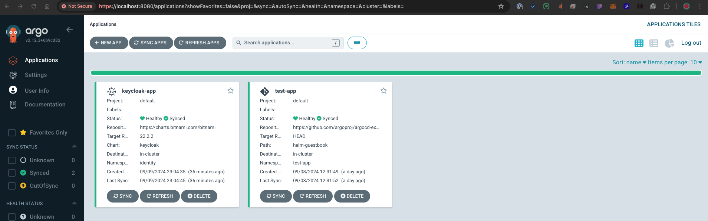
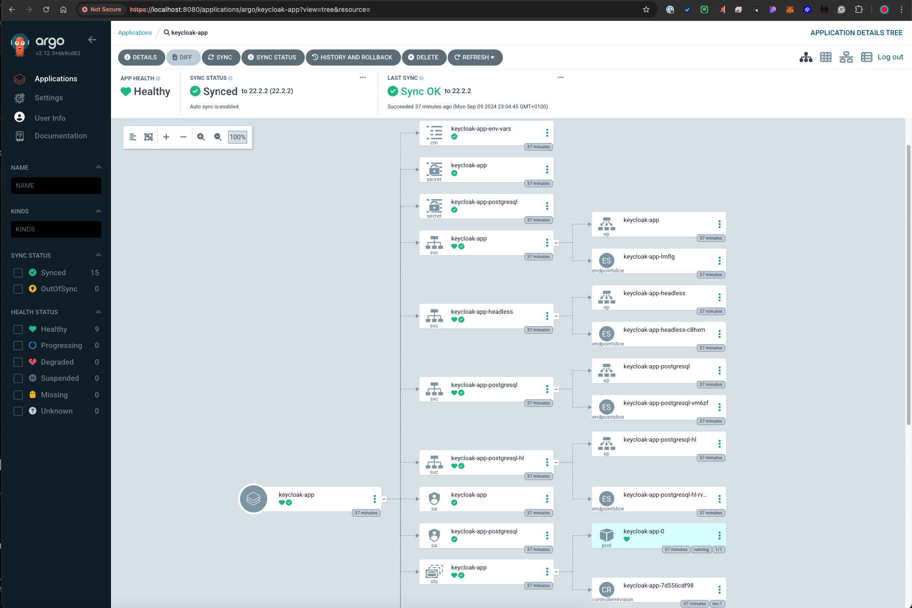
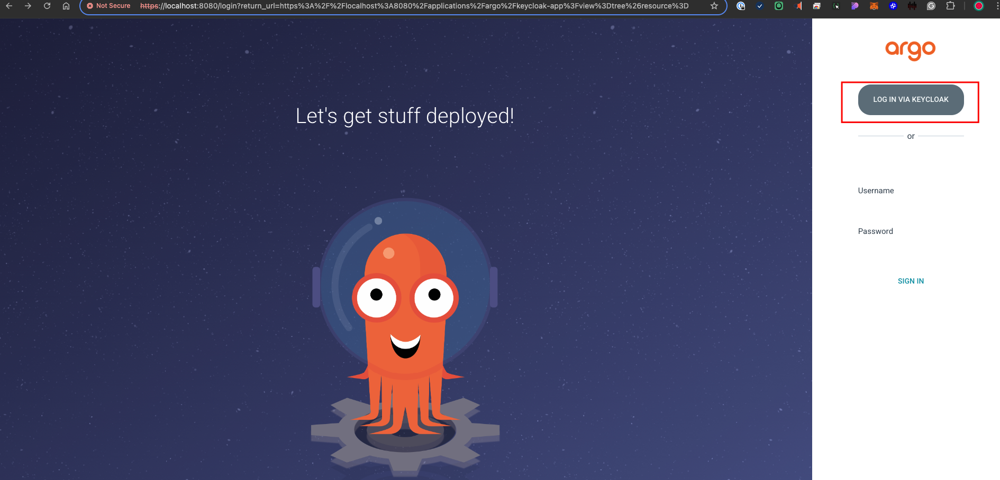
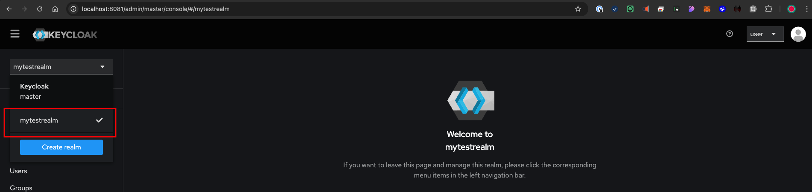
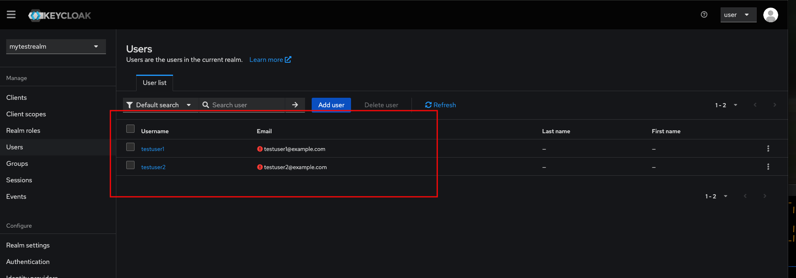
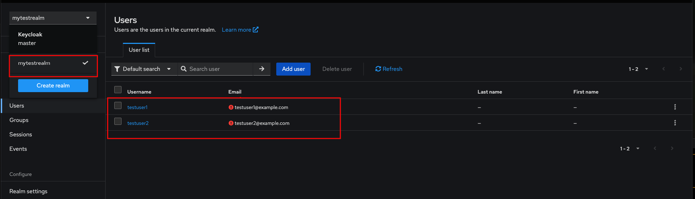

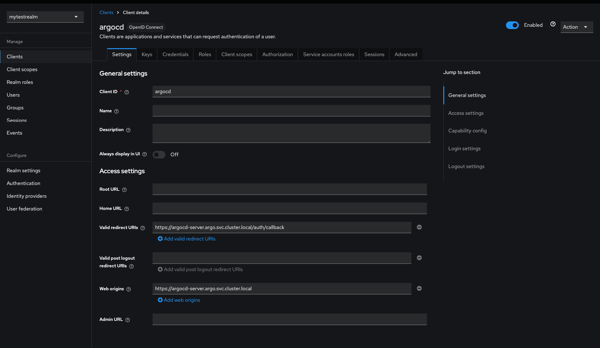
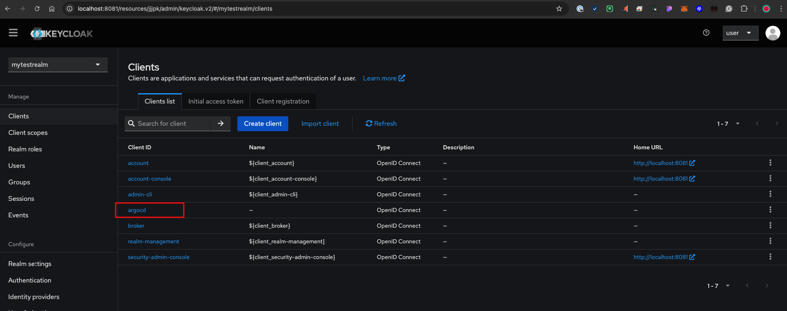
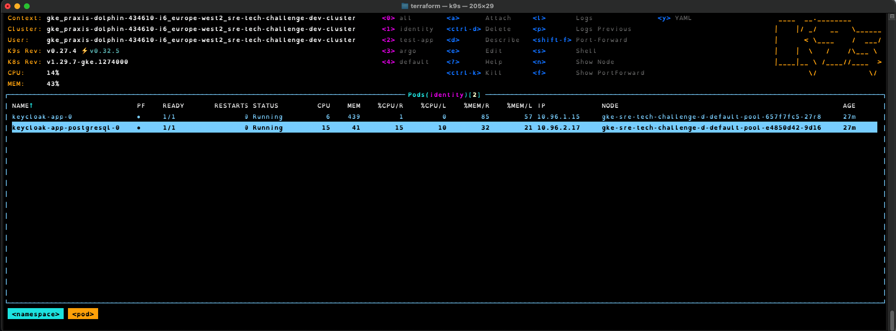
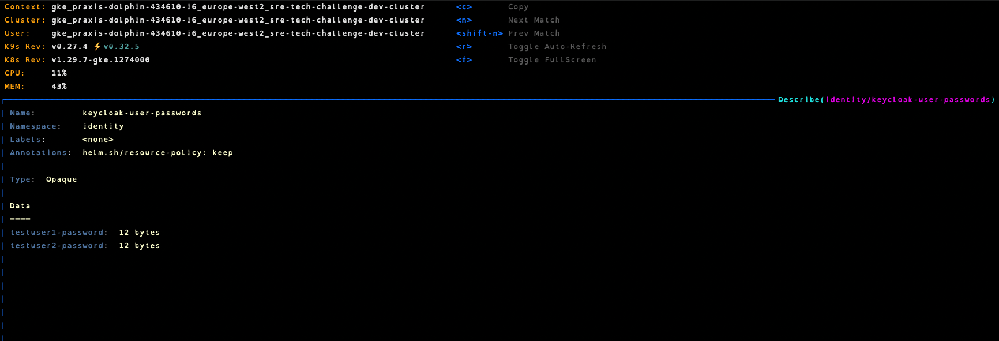
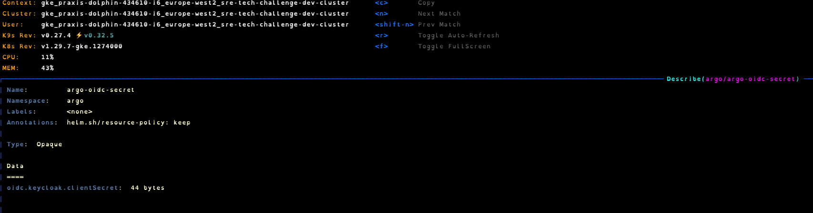

## Production Readiness Considerations

### High Availability
- **Current Setup**: Keycloak is deployed as a single instance in the `identity` namespace.
- **Production Improvements**: For production, consider deploying Keycloak in a highly available configuration with multiple replicas and using an external PostgreSQL database for better resilience.

### Security
- **Current Setup**: Secrets such as user passwords and client secrets are stored in Kubernetes Secrets. Keycloak is deployed without SSL for internal development.
- **Production Improvements**:
  - Enable **TLS/SSL** for secure communication.
  - Configure **RBAC** within ArgoCD to restrict access to specific users and groups.
  - Integrate with a centralized secrets management system, like Google Cloud Secret Manager, for enhanced secret management.

### Scalability
- **Current Setup**: Single instance of Keycloak is used for this environment.
- **Production Improvements**:
  - Scale Keycloak horizontally by deploying multiple replicas.
  - Use a load balancer and auto-scaling configuration to handle increased loads.

### Disaster Recovery
- **Current Setup**: Keycloak and ArgoCD configurations are stored in Git and synchronized via ArgoCD.
- **Production Improvements**:
  - Set up regular backups of Keycloak’s configuration and database.
  - Implement multi-region disaster recovery to ensure availability during a failure event.

### Monitoring and Observability
- **Current Setup**: No monitoring implemented (will be completed in optional task).
- **Production Improvements**:
  - Set up monitoring using Prometheus and Grafana.
  - Define Service Level Objectives (SLOs) and Service Level Indicators (SLIs) for both Keycloak and ArgoCD to ensure performance and reliability.

## Related PR
- [Task 3: Keycloak Deployment](https://github.com/cmclean90/sre-tech-challenge/pull/5)
